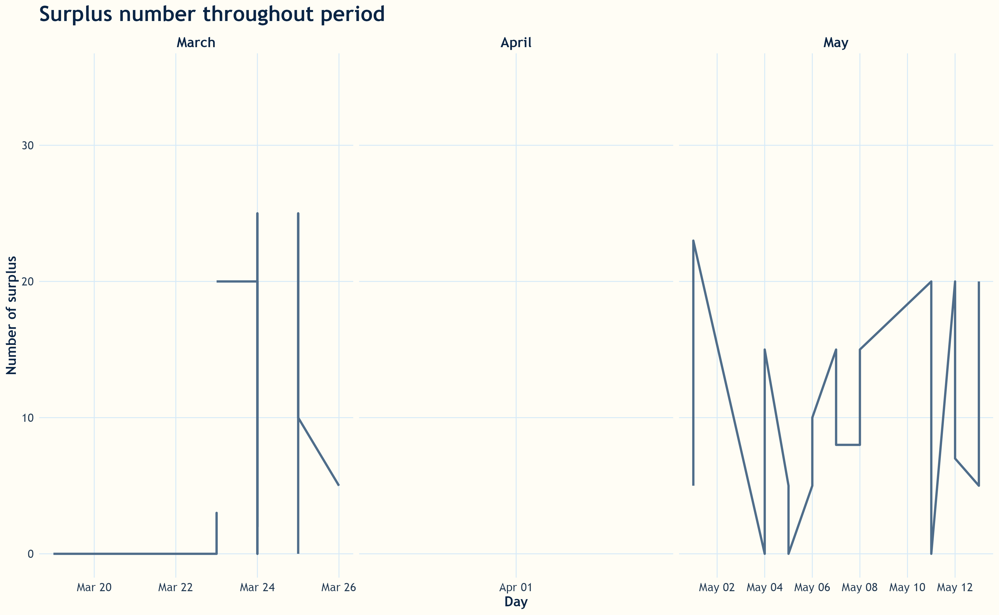
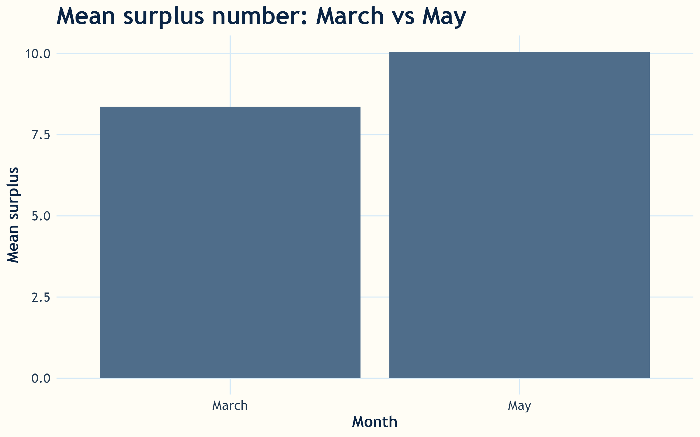
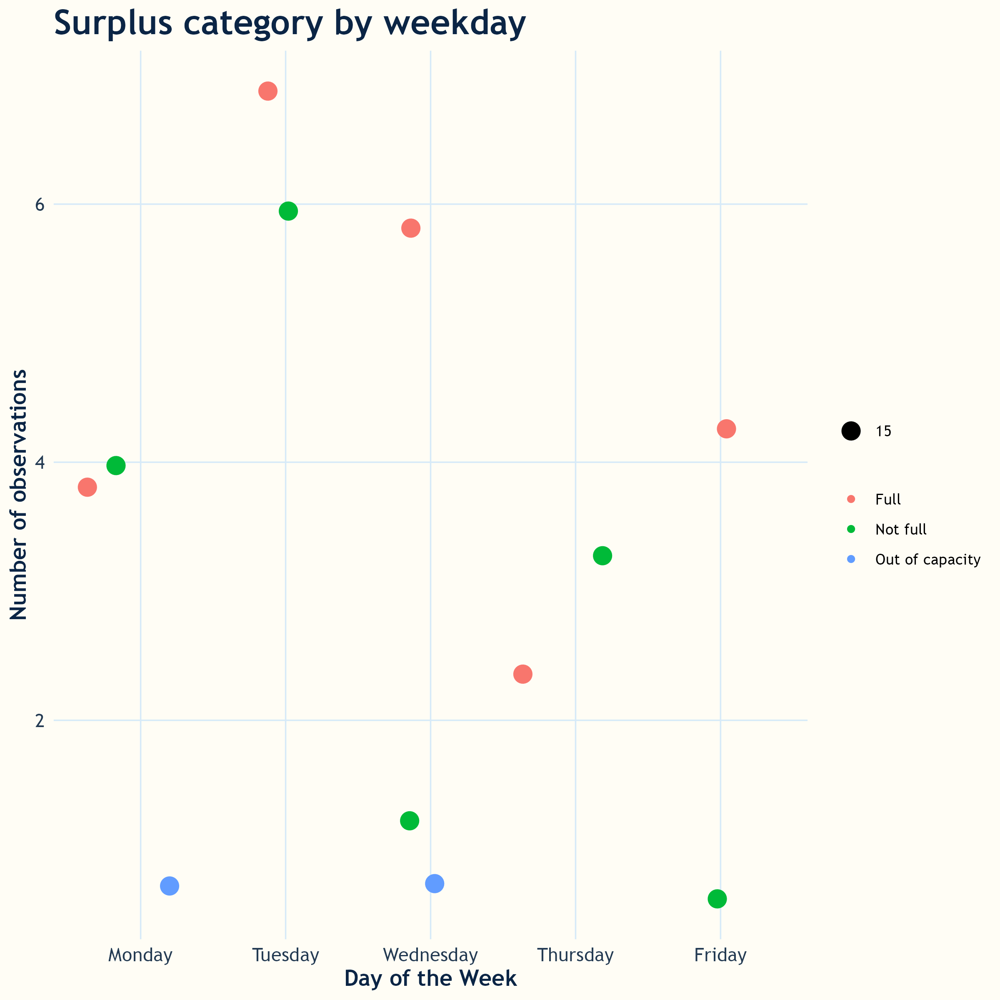
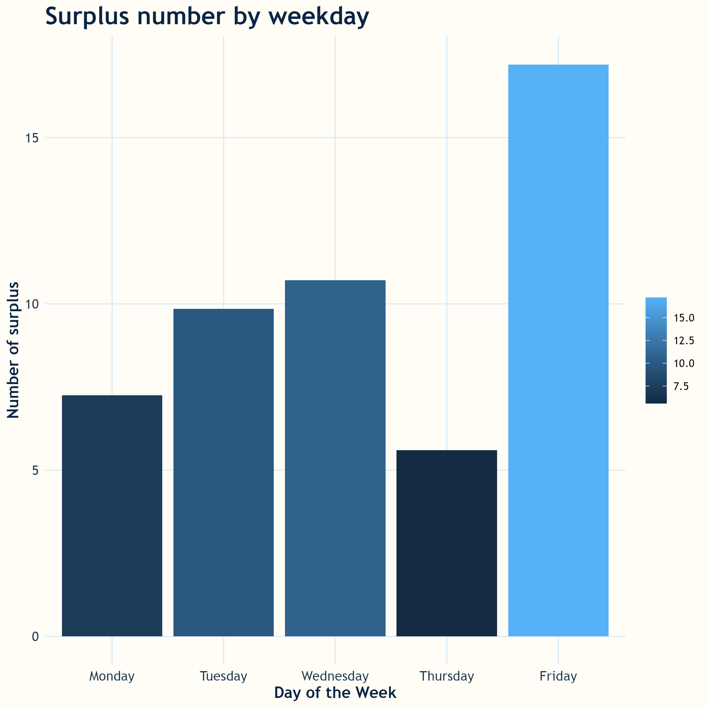
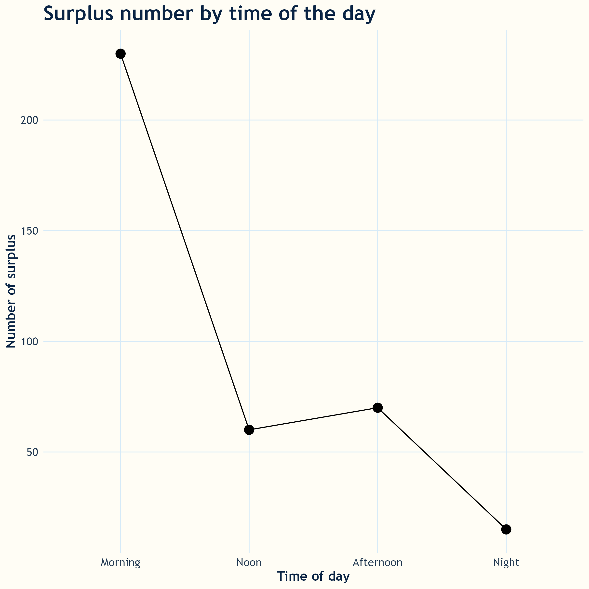
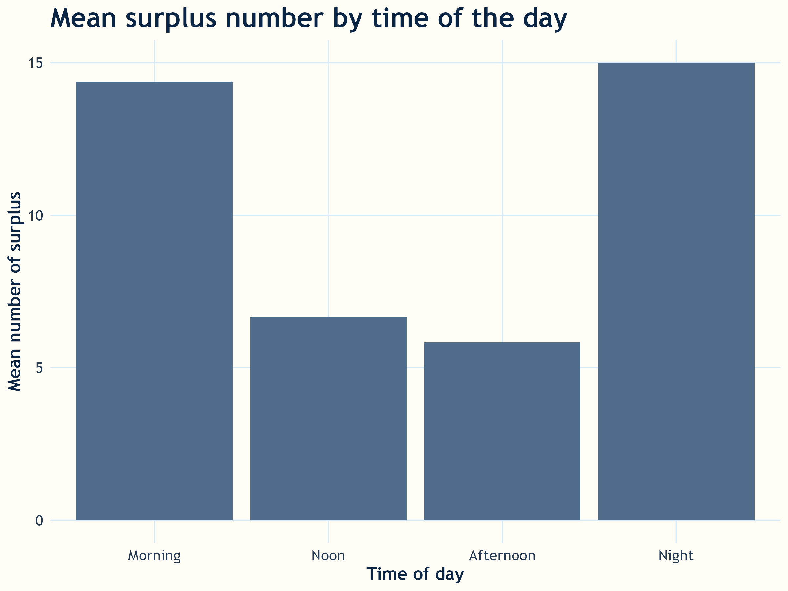

<script src="https://code.jquery.com/jquery-3.7.1.min.js" integrity="sha256-/JqT3SQfawRcv/BIHPThkBvs0OEvtFFmqPF/lYI/Cxo=" crossorigin="anonymous"></script>

```{r setup, include=FALSE}
knitr::opts_chunk$set(echo=FALSE, message=FALSE, warning=FALSE, error=FALSE)
```

```{js}
$(function() {
  $(".level2").css('visibility', 'hidden');
  $(".level2").first().css('visibility', 'visible');
  $(".container-fluid").height($(".container-fluid").height() + 300);
  $(window).on('scroll', function() {
    $('h2').each(function() {
      var h2Top = $(this).offset().top - $(window).scrollTop();
      var windowHeight = $(window).height();
      if (h2Top >= 0 && h2Top <= windowHeight / 2) {
        $(this).parent('div').css('visibility', 'visible');
      } else if (h2Top > windowHeight / 2) {
        $(this).parent('div').css('visibility', 'hidden');
      }
    });
  });
})
```

```{css, echo=FALSE}
.figcaption {display: none}
body {
  background-color: #FFFDF5;
  color: #0B2545;
  font-family: "Trebuchet MS", Arial, sans-serif;
}

h1, h2, h3, h4 {
  color: #2E5A88;
  font-family: "Trebuchet MS", Arial, sans-serif;
  font-weight: 700;
}

p, li {
  color: #243B53;
  font-size: 16px;
  line-height: 1.6;
}

a {
  color: #4F6D8A;
  font-weight: 600;
}

blockquote {
  border-left: 5px solid #F2C94C;
  background-color: #FFF8DC;
  padding: 12px 18px;
  color: #0B2545;
}

table {
  border-collapse: collapse;
  width: 100%;
}

th {
  background-color: #4F6D8A;
  color: white;
}

td {
  border-bottom: 1px solid #D6EAF8;
}

.main-container {
  max-width: 1000px;
}

.title {
  color: #0B2545;
  font-weight: 800;
}
```
```

## Context
The NX2 bus connects the major bus stations of the North Shore to the CBD across the Harbour Bridge. Each day, hundreds of office workers and university students take this route. Taking this route daily, I've noticed that certain times, there are so many people packed on a bus, causing inconvenience and signals inefficiency in bus allocation. After a period of 4 weeks of NX2 bus trips from the North Shore to CBD and back, the data on bus surplus/ congestion of people on bus was collected. This data story will walk through surplus patterns through time, to uncover patterns that will inform decision-making on bus allocation for NX2 routes.

## Big snapshot of the whole data-collecting period



NX2 congestion levels varied considerably throughout the observed period. March showed a gradual rise in surplus numbers, including several sharp increases where passenger demand exceeded available seating capacity. 

May displayed the greatest volatility, with congestion levels repeatedly fluctuating between very low and very high surplus numbers within short time periods. These rapid changes may reflect inconsistent passenger demand, timetable changes, weather conditions, or variations in commuter behaviour across weekdays.

April contained little or no recorded data, creating a visible gap in the timeline. Overall, the graph highlights that NX2 congestion was not stable over time and instead experienced recurring spikes that may require more responsive scheduling and capacity planning strategies.



The average surplus number increased from March to May, suggesting that congestion on the NX2 bus route became more severe over time. May recorded the highest mean surplus level, indicating that passengers were more likely to experience crowded conditions and standing during this month.

This increase may reflect growing passenger demand, seasonal travel changes, or pressure caused by limited service capacity during peak commuting periods. Although the difference between the two months is moderate, the upward trend suggests that congestion patterns may be intensifying rather than improving.

The graph reinforces earlier findings that NX2 congestion is a recurring issue, particularly during peak travel periods, and may require operational adjustments such as increased service frequency or larger-capacity buses.

### Pattern by weekday



Weekday commuting demand on the NX2 route is concentrated during core office days, creating recurring midweek congestion pressure.

The NX2 bus experienced the most congestion during the middle of the work week, particularly on Tuesday and Wednesday. These days showed the highest number of “Full” bus observations, indicating stronger commuter demand during peak business activity periods. 

Although “Out of capacity” events were less frequent, they still occurred on multiple weekdays, suggesting that overcrowding occasionally exceeded the available bus space. Friday showed fewer congestion observations overall compared with Tuesday and Wednesday, which may reflect more flexible travel behaviour toward the end of the week.



Friday recorded the highest average surplus number on the NX2 bus, indicating that passengers were more likely to stand or experience crowding at the end of the week. In contrast, Thursday had the lowest average surplus, suggesting lighter passenger demand and less congestion pressure.

Tuesday and Wednesday also showed relatively high surplus levels, reinforcing the pattern that congestion is strongest during active weekday commuting periods. Monday displayed moderate congestion levels, likely reflecting a gradual increase in travel demand after the weekend.

This pattern suggests that passenger congestion on the NX2 route is not evenly distributed throughout the week. Instead, congestion intensifies during key commuting and social activity days, particularly Friday afternoons and evenings.

### Pattern by time of the day



Morning periods experienced significantly higher congestion levels than any other time of day on the NX2 bus route. The total surplus number during the morning was substantially larger than noon, afternoon, or night periods, highlighting the impact of peak-hour commuting demand.

Congestion dropped sharply after the morning rush, with noon and afternoon periods showing much lower surplus numbers. Night-time travel recorded the lowest congestion levels overall, indicating reduced passenger demand later in the day.

This trend demonstrates that NX2 congestion is strongly tied to daily commuting patterns. The sharp morning peak suggests that many passengers rely on the NX2 service for work and education travel, creating concentrated demand during early hours. These findings may support future decisions around increasing morning service frequency or improving peak-hour capacity management.




The average surplus number was highest during the night and morning periods, indicating that passengers were more likely to experience standing congestion during these times. Morning congestion is likely linked to work and school commuting, where passenger demand becomes concentrated during peak travel hours.

Interestingly, night periods also recorded very high average surplus levels despite having fewer total observations overall. This suggests that while night congestion occurred less frequently, the crowding events that did occur were often severe. Reduced service frequency during late hours may contribute to these higher congestion averages.

In comparison, noon and afternoon periods experienced much lower average surplus numbers, indicating more balanced passenger loads and lower pressure on bus capacity throughout the middle of the day.


## Final insight and recommendation

The analysis shows that congestion on the NX2 bus route is not evenly distributed across the week or throughout the day. The strongest congestion patterns consistently occurred during weekday commuting periods, especially during mornings and on high-demand weekdays such as Tuesday, Wednesday, and Friday. Several observations also showed buses reaching full or out-of-capacity conditions, indicating that some passengers experienced overcrowding and reduced comfort during travel.

The results suggest that passenger demand on the NX2 route is heavily influenced by work, education, and peak-hour commuting behaviour. While congestion was lower during noon and afternoon periods, severe crowding still appeared during selected night services, likely due to reduced service frequency.

To improve passenger experience and reduce overcrowding, Auckland Transport could consider increasing NX2 service frequency during peak morning and end-of-week periods. Additional double-decker buses or higher-capacity services may also help reduce standing congestion on the busiest trips. Monitoring congestion trends over longer periods would allow transport planners to better predict demand and adjust timetables more effectively.

Overall, the findings demonstrate that data visualisation can help identify recurring congestion patterns and support evidence-based transport planning decisions for improving the reliability and comfort of public transport services.